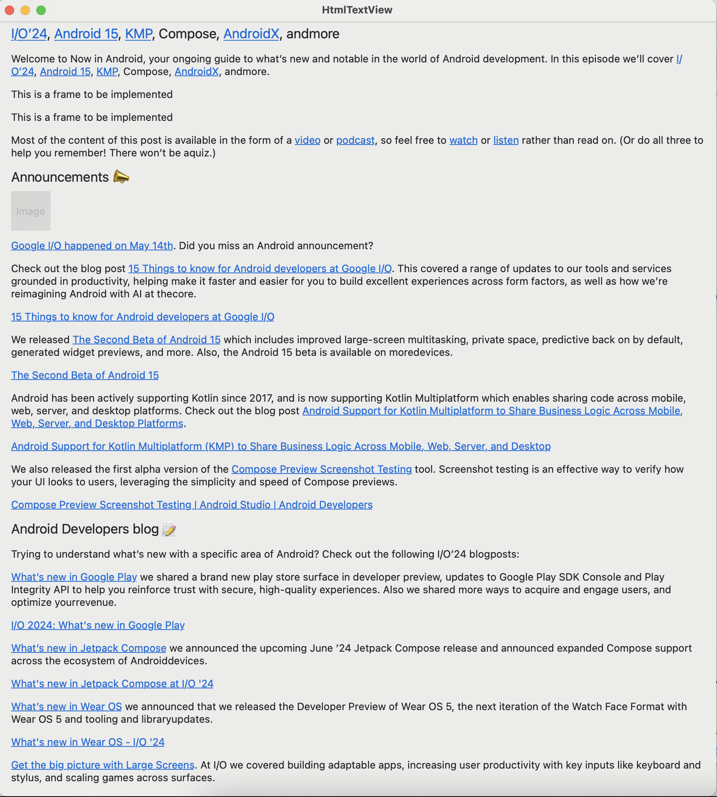

#  HtmlTextView

**Sample Code**

```swift
struct ContentView: View {
    var body: some View {
        ScrollView {
	    // PreviewData.developer2 is sample html text
            HtmlTextView(PreviewData.developer2).padding()
        }
    }
}
```

**Sample Image**



